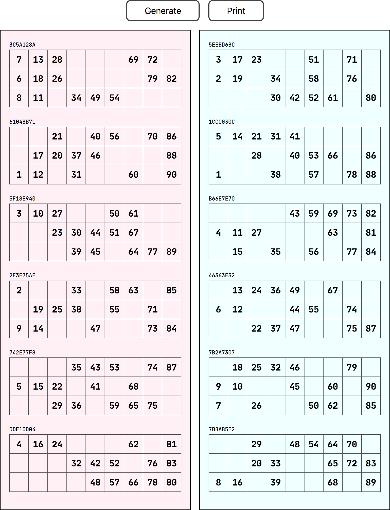

# Tambola Tickets Generator

A PWA that generates the tambola tickets the way it should be. It meets all the following constraints.

https://praveenpuglia.com/tambola-tickets

## Constraints

- Each ticket has 3 rows with 9 cells each.
- Each ticket contains 15 numbers.
- Each row must have 5 numbers.
- Each page should have 6 tickets that account for all 90 numbers.
- When we talk about numbers in every ticket, they contain all unique numbers.
- For each column in ticket, there can be a max of 3 numbers.
- No ticket should have empty column / columns
- The numbers in every column must be sorted ascending.
