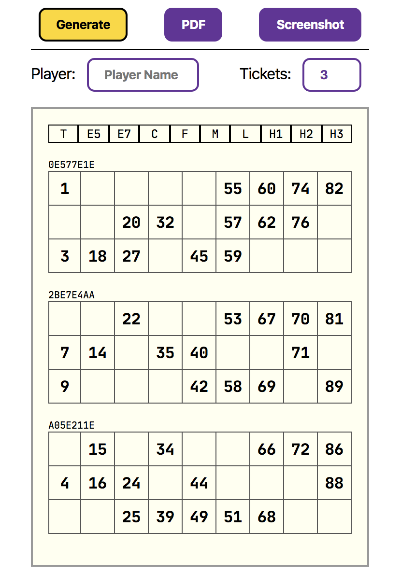

# Tambola Tickets Generator
https://praveenpuglia.com/tambola-tickets

> 🚨At times, the app may seem unresponsive because the generation would fail for one or more tickets. In those times, wait up to 10 seconds or reload. 

## Rules

- Each ticket has 3 rows with 9 cells each.
- Each ticket contains 15 numbers.
- Each row must have 5 numbers.
- Each page should have 6 tickets that account for all 90 numbers.
- When we talk about numbers in every ticket, they contain all unique numbers.
- For each column in ticket, there can be a max of 3 numbers.
- No ticket should have empty column / columns

## Todo
- [ ] Move computation to a Web Worker to keep the UI responsive in some cases where the generation fails to due call stack overflow.
- [ ] Guarantee there will be no stack overflow.
